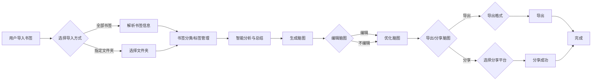

# BookmarkMind 智能书签管理平台

## 产品定位

面向数字知识工作者的智能书签管理工具，通过AI技术将零散的网页书签转化为结构化知识网络，实现「书签 → 知识 → 洞察」的认知升级。

## 核心价值 ✨

- **智能解析**：自动提取网页核心内容，生成结构化知识卡片
- **多维可视化**：支持脑图/时间轴/3D空间三种知识呈现模式 ️
- **无缝迁移**：兼容主流浏览器书签格式一键导入
- **隐私守护**：端到端加密存储，用户数据完全自主控制

## 1. 产品概述

本产品是一款基于浏览器书签的智能分析与脑图生成工具，旨在帮助用户更有效地管理、理解和利用个人知识库。通过智能分析书签内容，提取关键信息，并以脑图等可视化形式呈现，帮助用户发现知识关联，激发灵感，提高学习和工作效率。

## 2. 目标用户 ‍‍

- **学生**：用于整理学习资料 、构建知识体系 、提高学习效率 。
- **研究人员**：用于收集研究文献 、分析研究成果 、发现研究热点 。
- **职场人士**：用于整理工作资料 、构建知识库 ️、提高工作效率 。
- **知识爱好者**：用于管理个人知识库 、发现知识关联 、拓展知识面 ️。

## 3. 核心功能

### 3.1 书签导入与解析

- 支持 Chrome 、Firefox 、Edge 等主流浏览器书签格式（HTML、JSON 等）的导入。
- 支持批量导入书签，可选择导入指定文件夹或全部书签。
- 自动解析书签的 URL 、标题 ️、描述 、添加时间 、Favicon 等信息。
- 提供书签分类 ️、标签管理功能，支持自定义分类和标签。 ️
- 支持书签搜索和过滤功能，可按关键词 、分类 ️、标签 ️等条件进行搜索和筛选。
- 支持书签去重功能，自动检测并去除重复书签。 ✅
- 支持书签导出为 HTML、JSON、CSV 等格式。

### 3.2 智能分析与总结

- 采用 NLP 和机器学习技术，对书签内容进行深入分析。
- 提取书签关键词 、主题 、情感 ❤️ 等信息。
- 对书签内容进行智能总结，生成简洁明了的摘要。
- 支持自定义分析维度和偏好设置，如关键词提取数量、主题分类粒度等。 ⚙️
- 支持多种语言分析（如中文 🇨🇳、英文 🇺🇸等）。
- 支持对书签内容进行情感分析，判断书签内容的情感倾向。
- 支持对书签进行聚类分析，将相似的书签归为一类。
- 支持生成书签分析报告，以图表  等形式展示分析结果。

### 3.3 脑图生成与编辑 ️ ️

- 根据书签分析结果，自动生成结构清晰、逻辑严谨的脑图。 ️
- 支持多种脑图布局和样式选择，如思维导图 ️、鱼骨图 、组织结构图 等。
- 提供丰富的脑图编辑功能，如节点增删改 ➕➖✏️、连线调整 ↔️、内容编辑 ✍️、样式设置 等。
- 支持在脑图节点中添加备注 、链接 、图片 ️等信息。
- 支持脑图导出为多种格式（如 PNG ️、PDF 、Markdown 、XMind 等）。 ⬇️
- 支持脑图分享功能，可将脑图分享给他人或发布到社交媒体。
- 支持脑图历史版本管理，可查看和恢复脑图的历史版本。 ↩️

### 3.4 个性化服务 ‍

- 根据用户角色（如学生 ‍、研究人员 ‍、职场人士 ‍等）和需求，提供定制化的分析和总结服务。
- 支持用户自定义关键词库 、主题分类 等。
- 提供智能推荐功能，帮助用户发现潜在的知识关联和灵感。
- 支持用户设置书签分析偏好，如关键词提取数量、主题分类粒度等。
- 支持用户创建个人知识库 ，用于存储和管理书签、分析结果和脑图。 ️
- 支持多平台同步 ，用户可在不同设备上访问和管理自己的书签和知识库。

### 3.5 其他功能 ➕

- **用户账号管理**：支持用户注册 、登录 、修改密码 等功能。
- **帮助与反馈**：提供用户帮助文档 ❓和在线反馈渠道。
- **界面友好**：界面简洁美观，操作便捷易用。 ✨
- **性能稳定**：系统运行稳定可靠，响应速度快。 ⚡
- **安全保障**：重视用户数据安全，采取必要的加密和保护措施。 ️

## 4. 产品特色 ✨

- **智能化**：采用先进的 NLP 和机器学习技术，提供高质量的分析和总结结果。
- **可视化**：通过脑图等可视化形式，帮助用户更直观地理解和记忆书签内容。 ️
- **个性化**：根据用户需求提供定制化服务，满足不同用户的个性化需求。  tailor-made
- **便捷性**：操作简单易用，支持多种平台和设备（如浏览器插件 、桌面应用 ️、移动应用 等）。

## 5. 技术栈 ️

- **前端**：HTML、CSS、JavaScript、React/Vue/Angular 等。
- **后端**：Python/Node.js 等。
- **数据库**：MySQL/MongoDB 等。
- **NLP 和机器学习**：TensorFlow/PyTorch 等。
- **脑图工具库**：D3.js/ECharts 等。

## 6. 盈利模式

- **订阅制**：提供不同功能的订阅套餐，满足不同用户的需求。
- **增值服务**：提供高级分析、定制化报告等增值服务。
- **合作推广**：与浏览器厂商、教育机构等合作，进行产品推广。

## 7. 推广策略

- **内容营销**：通过博客 、社交媒体 等渠道分享产品相关知识和案例。 ✍️
- **搜索引擎优化（SEO）**：优化产品网站和内容，提高搜索排名。
- **应用商店推广**：在 Chrome 网上应用店等平台发布产品。
- **合作推广**：与浏览器厂商、教育机构等合作，进行产品推广。

## 8. 产品流程图 ️ ️

